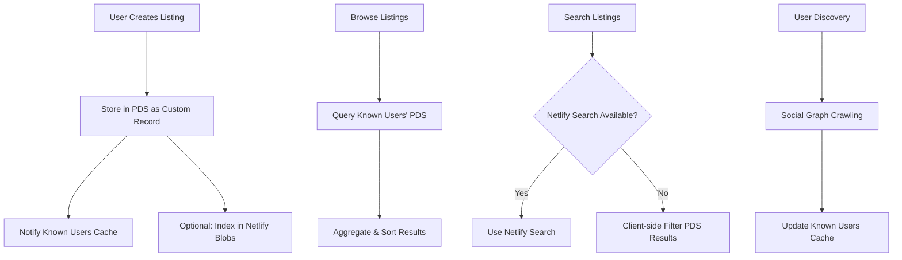

# Marketplace Listing Storage Analysis and Solution

## 1. Current Issue: Why Listings Aren't Being Saved

After analyzing the marketplace implementation, I've identified the root cause of why listings aren't appearing:

### Problem Analysis

1. **Environment Configuration Missing**: The marketplace requires specific environment variables to function properly:
   - `NEXT_PUBLIC_USE_CUSTOM_RECORDS=true` - Enables custom AT Protocol records
   - `NEXT_PUBLIC_MARKETPLACE_APPVIEW_URL=/.netlify/functions` - Points to Netlify Functions

2. **AppView Dependency**: The current implementation heavily relies on Netlify Functions (AppView) for listing retrieval:
   - `getAllListings()` returns empty results if AppView is not configured
   - The browse page shows no listings because it can't fetch from the AppView

3. **Dual Storage Approach**: The system uses both:
   - **AT Protocol PDS**: Stores listings as custom records (`com.marketplace.listing`)
   - **Netlify Blobs**: Indexes listings for search and browsing via AppView

4. **Network Dependency**: If Netlify Functions fail or are not deployed, listings become invisible even though they exist in the PDS.

## 2. How WhiteWind Stores Blog Posts

WhiteWind uses a simpler, more reliable approach:

### WhiteWind's Storage Pattern

1. **Custom AT Protocol Records**: Blog posts are stored as `com.whtwnd.blog.entry` records in users' Personal Data Servers (PDS)
2. **Direct PDS Queries**: Retrieval happens directly from PDS without requiring external indexing services
3. **Lexicon-Defined Schema**: Uses AT Protocol lexicons to define data structure
4. **Media as Blobs**: Images and media are stored as AT Protocol blobs
5. **Decentralized by Design**: No dependency on centralized indexing services

### WhiteWind's Advantages

- **Reliability**: Works even if external services are down
- **Simplicity**: Single source of truth (PDS)
- **Decentralization**: True to AT Protocol principles
- **Performance**: Direct queries to user's own PDS

## 3. Recommended Solution: Adopt WhiteWind's Approach

### Implementation Plan

#### Phase 1: Fix Current Implementation

1. **Environment Configuration**:
   ```env
   # Required for marketplace functionality
   NEXT_PUBLIC_USE_CUSTOM_RECORDS=true
   NEXT_PUBLIC_ENABLE_CROSS_POSTING=false
   NEXT_PUBLIC_MARKETPLACE_APPVIEW_URL=/.netlify/functions
   ```

2. **Improve Fallback Logic**: Modify `getAllListings()` to provide meaningful fallback when AppView is unavailable

#### Phase 2: Implement WhiteWind-Style Storage

1. **Enhanced Direct PDS Queries**:
   ```typescript
   // Improved getUserListings with better PDS querying
   export async function getUserListings(did?: string) {
     const agent = await getAgent();
     const targetDid = did || agent.session?.did;
     
     // Always query PDS directly (like WhiteWind)
     const response = await agent.com.atproto.repo.listRecords({
       repo: targetDid,
       collection: 'com.marketplace.listing',
       limit: 100, // Reasonable limit
     });
     
     return response.data.records.map(record => ({
       uri: record.uri,
       cid: record.cid,
       record: record.value as ListingRecord,
       author: { did: targetDid },
       indexedAt: record.value.createdAt
     }));
   }
   ```

2. **Multi-User Aggregation**:
   ```typescript
   // Aggregate listings from multiple known users
   export async function getAllListingsFromKnownUsers(userDids: string[]) {
     const allListings = [];
     
     for (const did of userDids) {
       try {
         const userListings = await getUserListings(did);
         allListings.push(...userListings);
       } catch (error) {
         console.warn(`Failed to fetch listings for ${did}:`, error);
       }
     }
     
     return allListings.sort((a, b) => 
       new Date(b.record.createdAt).getTime() - new Date(a.record.createdAt).getTime()
     );
   }
   ```

3. **Local Caching Strategy**:
   ```typescript
   // Cache known marketplace users locally
   const KNOWN_MARKETPLACE_USERS_KEY = 'marketplace_known_users';
   
   export function addKnownMarketplaceUser(did: string) {
     const known = getKnownMarketplaceUsers();
     if (!known.includes(did)) {
       known.push(did);
       localStorage.setItem(KNOWN_MARKETPLACE_USERS_KEY, JSON.stringify(known));
     }
   }
   
   export function getKnownMarketplaceUsers(): string[] {
     try {
       const stored = localStorage.getItem(KNOWN_MARKETPLACE_USERS_KEY);
       return stored ? JSON.parse(stored) : [];
     } catch {
       return [];
     }
   }
   ```

#### Phase 3: Hybrid Approach (Best of Both Worlds)

1. **Primary Storage**: AT Protocol PDS (like WhiteWind)
2. **Optional Indexing**: Netlify Blobs for enhanced search (when available)
3. **Graceful Degradation**: Fall back to PDS-only when indexing fails

### Updated Architecture



## 4. Required Environment Variables

```env
# Core AT Protocol Configuration
NEXTAUTH_SECRET=your_generated_secret_here
NEXTAUTH_URL=http://localhost:3000

# Marketplace Configuration
NEXT_PUBLIC_USE_CUSTOM_RECORDS=true
NEXT_PUBLIC_ENABLE_CROSS_POSTING=false

# Optional: Enhanced search via Netlify Functions
NEXT_PUBLIC_MARKETPLACE_APPVIEW_URL=/.netlify/functions

# Optional: Bluesky API for cross-posting
BLUESKY_API_URL=https://bsky.social
```

## 5. Testing and Verification Steps

### Step 1: Verify Environment Setup
```bash
# Check if environment variables are set
echo $NEXT_PUBLIC_USE_CUSTOM_RECORDS
echo $NEXT_PUBLIC_MARKETPLACE_APPVIEW_URL
```

### Step 2: Test Listing Creation
1. Create a new listing through the UI
2. Verify the listing appears in the user's PDS:
   ```typescript
   // Debug: Check if listing was created
   const agent = await getAgent();
   const records = await agent.com.atproto.repo.listRecords({
     repo: agent.session?.did,
     collection: 'com.marketplace.listing'
   });
   console.log('User listings:', records.data.records);
   ```

### Step 3: Test Listing Retrieval
1. Navigate to browse page
2. Check browser console for API calls
3. Verify listings appear (even if only user's own listings)

### Step 4: Test Netlify Functions (Optional)
1. Deploy to Netlify
2. Test AppView endpoints:
   ```bash
   curl -X GET "https://your-site.netlify.app/.netlify/functions/com-marketplace-getAllListings"
   ```

## 6. Migration Strategy

### Immediate Fix (Low Risk)
1. Update `.env.example` with required variables
2. Improve error handling in `getAllListings()`
3. Add debug logging to identify configuration issues

### Medium-term Enhancement
1. Implement direct PDS querying fallback
2. Add known users caching mechanism
3. Improve user discovery through social graph

### Long-term Optimization
1. Implement hybrid storage approach
2. Add advanced search capabilities
3. Consider federation with other marketplace instances

## 7. Conclusion

The current marketplace implementation is architecturally sound but suffers from over-dependence on external indexing services. By adopting WhiteWind's approach of prioritizing direct PDS storage and queries, we can create a more reliable, decentralized marketplace that works even when external services are unavailable.

The key is to treat AT Protocol PDS as the primary source of truth (like WhiteWind does with blog posts) while using external indexing as an optional enhancement for better search and discovery capabilities.