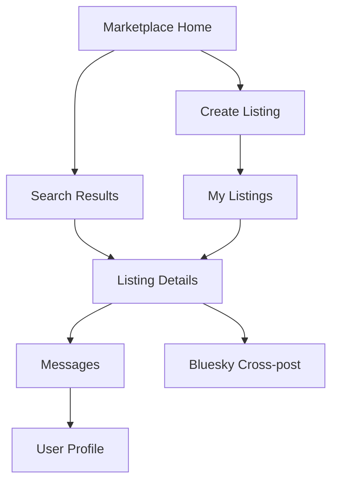

# Marketplace Migration to Whitewind-Style Architecture

## 1. Product Overview

Migrate our AT Protocol marketplace from embedding listings in Bluesky posts to a dedicated application architecture similar to Whitewind blog. The new system will store marketplace data as custom records in users' Personal Data Servers (PDS) while maintaining optional cross-posting to Bluesky for discovery.

This migration enables true data ownership, better marketplace-specific features, and separation of concerns between social media and marketplace functionality. The target is to create a professional marketplace platform that leverages AT Protocol's decentralized infrastructure while providing specialized commerce tools.

## 2. Core Features

### 2.1 User Roles

| Role | Registration Method | Core Permissions |
|------|---------------------|------------------|
| Marketplace User | AT Protocol account (Bluesky login) | Create listings, browse marketplace, message sellers |
| Verified Seller | Account verification process | Enhanced listing features, seller badges, analytics |

### 2.2 Feature Module

Our marketplace migration consists of the following main components:

1. **Custom Lexicon System**: Define `com.marketplace.listing` and related schemas for marketplace-specific data
2. **Backend AppView Service**: Index and serve marketplace data from distributed PDS instances
3. **Listing Management Interface**: Create, edit, and manage marketplace listings stored as custom records
4. **Search and Discovery API**: Advanced search capabilities for marketplace-specific queries
5. **Cross-posting Integration**: Optional Bluesky post creation with links to full marketplace listings
6. **User Profile System**: Marketplace-specific user profiles and seller reputation
7. **Messaging System**: Direct communication between buyers and sellers

### 2.3 Page Details

| Page Name | Module Name | Feature description |
|-----------|-------------|---------------------|
| Marketplace Home | Listing Feed | Display recent listings from custom records, category filters, location-based search |
| Listing Details | Full Listing View | Show complete listing data from PDS records, seller contact, image gallery |
| Create Listing | Listing Editor | Form to create `com.marketplace.listing` records, image upload to PDS, category selection |
| My Listings | Seller Dashboard | Manage user's marketplace listings, edit records, view analytics |
| Search Results | Advanced Search | Filter by category, location, price range using marketplace-specific indexing |
| User Profile | Seller Profile | Display marketplace-specific user data, listing history, reputation |
| Messages | Communication | Direct messaging system for buyer-seller communication |

## 3. Core Process

**Listing Creation Flow:**
User creates listing → Data stored as `com.marketplace.listing` record in their PDS → AppView indexes the record → Optional Bluesky cross-post created with link → Listing appears in marketplace search

**Discovery Flow:**
User searches marketplace → AppView queries indexed records → Results displayed with marketplace-specific data → User views full listing from PDS record

**Cross-posting Flow:**
Listing created → Generate summary post for Bluesky → Post includes link to full marketplace listing → Social engagement drives traffic to marketplace



## 4. User Interface Design

### 4.1 Design Style

- **Primary Colors**: Deep blue (#1e40af) and marketplace orange (#f97316)
- **Secondary Colors**: Light gray (#f8fafc) backgrounds, dark gray (#374151) text
- **Button Style**: Rounded corners with subtle shadows, hover animations
- **Typography**: Inter font family, 16px base size, clear hierarchy
- **Layout Style**: Card-based design with clean spacing, prominent CTAs
- **Icons**: Lucide React icons for consistency, marketplace-specific symbols

### 4.2 Page Design Overview

| Page Name | Module Name | UI Elements |
|-----------|-------------|-------------|
| Marketplace Home | Hero Section | Large search bar, category tiles, featured listings carousel |
| Listing Details | Image Gallery | High-resolution image viewer, seller contact card, action buttons |
| Create Listing | Form Interface | Multi-step form, image upload with preview, category selector |
| Search Results | Filter Sidebar | Advanced filters, map view toggle, sorting options |
| My Listings | Dashboard Cards | Listing status indicators, quick edit buttons, analytics widgets |
| Messages | Chat Interface | Real-time messaging, listing context, seller verification badges |

### 4.3 Responsiveness

Mobile-first responsive design with touch-optimized interactions. Desktop experience includes advanced features like map view and detailed analytics. Progressive enhancement ensures core functionality works across all devices.

## 5. Technical Architecture

### 5.1 Custom Lexicon Design

**Primary Record Type: `com.marketplace.listing`**
```json
{
  "lexicon": 1,
  "id": "com.marketplace.listing",
  "defs": {
    "main": {
      "type": "record",
      "description": "A marketplace listing record",
      "key": "tid",
      "record": {
        "type": "object",
        "required": ["title", "description", "price", "category", "location", "createdAt"],
        "properties": {
          "title": {"type": "string", "maxLength": 200},
          "description": {"type": "string", "maxLength": 5000},
          "price": {"type": "string", "maxLength": 50},
          "category": {"type": "string", "maxLength": 100},
          "condition": {"type": "string", "enum": ["new", "like-new", "good", "fair", "poor"]},
          "location": {"type": "ref", "ref": "#location"},
          "images": {"type": "array", "items": {"type": "blob"}},
          "tags": {"type": "array", "items": {"type": "string"}},
          "createdAt": {"type": "string", "format": "datetime"},
          "expiresAt": {"type": "string", "format": "datetime"},
          "allowMessages": {"type": "boolean", "default": true}
        }
      }
    }
  }
}
```

**Supporting Types:**
- `com.marketplace.message`: Direct messaging between users
- `com.marketplace.profile`: Marketplace-specific user profiles
- `com.marketplace.review`: Seller reviews and ratings

### 5.2 Backend AppView Service

**Core Components:**
- **Firehose Subscriber**: Listen for marketplace record events from AT Protocol network
- **Record Indexer**: Parse and index `com.marketplace.*` records for search
- **Search API**: Provide advanced search and filtering capabilities
- **User API**: Manage marketplace-specific user data and preferences
- **Messaging API**: Handle direct communication between users
- **Cross-posting Service**: Generate and post Bluesky summaries with marketplace links

**API Endpoints:**
- `GET /api/listings` - Search and browse listings
- `GET /api/listings/{id}` - Get specific listing details
- `POST /api/listings` - Create new listing (proxy to PDS)
- `PUT /api/listings/{id}` - Update listing (proxy to PDS)
- `DELETE /api/listings/{id}` - Delete listing (proxy to PDS)
- `GET /api/users/{did}/listings` - Get user's listings
- `POST /api/messages` - Send message to seller
- `GET /api/messages` - Get user's messages

### 5.3 Data Flow Architecture

1. **Record Creation**: User creates listing → Stored as custom record in their PDS → Event published to AT Protocol firehose
2. **Indexing**: AppView subscribes to firehose → Processes marketplace records → Updates search index
3. **Discovery**: User searches → AppView queries index → Returns results with PDS record references
4. **Cross-posting**: Listing created → AppView generates summary → Posts to Bluesky with marketplace link

### 5.4 Migration Strategy

**Phase 1: Parallel System**
- Deploy new custom lexicon and AppView service
- Maintain existing Bluesky posting for compatibility
- Gradually migrate users to new system

**Phase 2: Feature Enhancement**
- Add marketplace-specific features (reviews, advanced search)
- Implement messaging system
- Enhanced seller profiles and verification

**Phase 3: Full Migration**
- Deprecate Bluesky embedding approach
- Focus on cross-posting for discovery only
- Full marketplace feature set

## 6. Implementation Priorities

### 6.1 MVP Features (Phase 1)
- Custom lexicon definition and validation
- Basic AppView service with listing indexing
- Listing creation and management interface
- Simple search and browse functionality
- Cross-posting to Bluesky with links

### 6.2 Enhanced Features (Phase 2)
- Advanced search with filters and location
- Direct messaging system
- User profiles and seller verification
- Image optimization and CDN integration
- Mobile app considerations

### 6.3 Advanced Features (Phase 3)
- Seller analytics and insights
- Review and rating system
- Payment integration considerations
- Advanced moderation tools
- Multi-language support

## 7. Success Metrics

- **Data Ownership**: 100% of listings stored as user-owned records in PDS
- **Performance**: Sub-200ms search response times
- **Adoption**: 80% of users migrate from embedded posts to custom records
- **Engagement**: Increased listing views through cross-posting strategy
- **Reliability**: 99.9% uptime for AppView service

This architecture provides true data ownership while maintaining discoverability through the existing Bluesky network, creating a best-of-both-worlds approach for decentralized marketplace functionality.